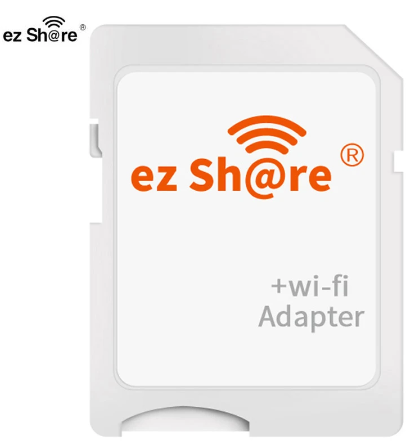
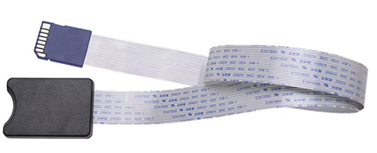

## Table of Contents

1. [Project Description](#project-description)
2. [Requirements](#requirements)
3. [Key Learnings & Limitations](#key-learnings--limitations)
4. [Code Functionality](#code-functionality)
5. [Feature Updates (Planned)](#feature-updates-planned)
6. [Installation](#installation)
   - [Setting up a Cron Job](#setting-up-a-cron-job)
7. [Acknowledgements](#acknowledgements)

# Project Description

This project was developed with the aim of providing a convenient solution for recording and sharing musical performances. The motivation behind it was a passion for music and the desire to improve performance through self-analysis and feedback from a coach.

The project was born out of the need for a wireless method to download .wav files from a zoom recorder without having to remove the SDHC card after every performance. After researching available options in March 2023, such as Toshiba FlashAir and axGear Wireless SDHC card, it became clear that these solutions were either discontinued or had unfavorable reviews. Eventually, the ezShare wireless SDHC card was chosen, despite some limitations.

One of the main challenges was that the ezShare SDHC card only supported ADHOC wireless functionality, which required constantly switching between the ezShare Wi-Fi SSID and home Wi-Fi SSID using a smartphone or Wi-Fi capable device to retrieve recorded performances. This process proved to be inconvenient and time-consuming.

To overcome these challenges, a Raspberry Pi 4 was utilized, taking advantage of its wired connection (eth0) to the home network and its wireless functionality (wlan0) to connect to the ezShare card. A Node.js app was then created to sync the files from the ezShare internal website to the Raspberry Pi, enabling easy access to the recordings through the home network. Furthermore, upon testing, I found that the wifi card interfered with the audio recording device so a SDHC Card extension cable was purchased to move the EZShare card away from the recording device, effectively preventing interference.

The project's code and documentation can be found on this GitHub repository, providing a comprehensive solution for wireless recording and file management.

# Requirements

Before using the code and working with the ezShare SDHC card, certain requirements must be met. Here are the key requirements and devices needed:

- **ezShare SDHC Card**: Obtain an ezShare SDHC card, which provides wireless functionality for file transfer. The card should be compatible with the devices you intend to use it with. It is recommended to acquire a genuine and reliable ezShare SDHC card to ensure optimal performance.



- **Device with Wireless Capability**: You will need a device capable of connecting to the ezShare SDHC card wirelessly. This device can be a Raspberry Pi, an old laptop, a netbook, or any other system that supports Node.js and has access to two network interfaces—one wired (Ethernet) and one wireless (Wi-Fi).

- Raspberry Pi (Optional): If you choose to use a Raspberry Pi, ensure you have a Raspberry Pi model (such as Raspberry Pi 4 or Raspberry Pi model 3B+) and necessary peripherals like power supply, microSD card, and Ethernet cable.

- SDHC Card Extension Cable (Optional): If you plan to use the ezShare SDHC card with certain audio recording devices prone to interference, such as the Zoom H2n, you may need an SDHC card extension cable. This cable allows you to move the ezShare card away from the device while still maintaining wireless access. However, be aware that using the extension cable may have implications on the device's physical accessibility, such as blocking the tripod mount or hindering the device's ease of use.



- **Node.js and npm**: Ensure that Node.js and npm (Node Package Manager) are installed on the device you plan to use. These tools are necessary for running the Node.js code and managing the project's dependencies.

By meeting these requirements and having the necessary devices, you can proceed with setting up the code and utilizing the ezShare SDHC card for wireless file transfer. Remember to consider any optional components like the SDHC card extension cable based on the specific devices you intend to use and their compatibility.

# Key Learnings & Limitations

During the development and usage of the code and the ezShare SDHC card, several key learnings and limitations have been identified. These provide important insights and considerations when working with the card and implementing the code. Here are the key learnings and limitations:

**Limitation**: Lack of HTTP POST Route: The ezShare card does not offer an HTTP POST route, which means that the code in its current form cannot directly upload files to the card. It is limited to downloading files from the card only.

**Limitation**: Interference with Audio Recording Devices: The ezShare Wifi SDHC card may cause interference when inserted into certain audio recording devices, such as the Zoom H2n recorder. To mitigate this issue, an SDHC card extension cable can be used. However, this extension cable has implications. For example, with the H2n recorder, the cable may obstruct access to the tripod mount and make it challenging to mount the device securely. Other Zoom recorders like the H4n Pro, H5, and H6, which have the card slot located away from the tripod mount, may be more suitable options in this case.

- Implication of SDHC Card Extension Cable: When using an SDHC card extension cable, it is essential to consider the specific device and its design. For example, with the H2n recorder, the flap that closes the SDHC card slot must remain open to accommodate the cable. This may block access to the tripod mount and make it difficult to mount the H2n on a tripod. It is important to assess the compatibility and practicality of using an extension cable based on the device's physical layout and intended usage.

**Versatility of Deployment**: While this project specifically utilizes a Raspberry Pi 4, it is not limited to that platform alone. The code can be deployed on various devices, including old laptops, netbooks, or any system capable of running Node.js with access to two network interfaces. One of the interfaces should be wireless to connect to the ezShare SDHC card. This flexibility allows you to adapt the code to your available resources and choose the most suitable device for your needs.

**File Compatibility**: The code has the ability to retrieve any file from the ezShare SDHC card, not just limited to .wav files. It provides the flexibility to grab any file available on the card, allowing you to download and work with various file formats according to your requirements.

Understanding these key learnings and limitations will help you navigate the usage of the ezShare SDHC card and ensure a successful implementation of the code. Consider the implications of using an SDHC card extension cable, explore device compatibility, and leverage the versatility of the code to handle various file types for a more tailored experience.

# Code Functionality

The provided code (app.js) allows you to wirelessly download files from an ezShare SDHC card using Node.js. It automates the process of retrieving files from the card and storing them on a local machine. Here's an explanation of the code's functionality:

1. The code uses the http module to make HTTP requests, fs module for file system operations, and cheerio module for HTML parsing.

2. The baseUrl variable defines the base URL of the ezShare card, and the urlPath variable specifies the path to access the files on the card.

3. The outputDir variable determines the directory where the downloaded files will be stored on your local machine.

4. The prepareDownloadFile function is responsible for downloading individual files. It takes an object containing the file URL (url) and the desired file name (fileName).

5. The code checks if the output directory exists and creates it if it doesn't.

6. The getFileSize function sends a HEAD request to retrieve the file size of a given URL.

7. The downloadFile function downloads a file from a given URL and saves it to the specified destination.

8. The getHtmlInfo function makes an HTTP request to the ezShare card and retrieves the HTML information from the specified URL and path.

9. The getDirListFromHtml function parses the HTML data and extracts a list of directories and files available on the ezShare card.

10. The getFileStructure function recursively fetches the file structure from directories and subdirectories, storing the files in an array.

11. The downloadDirPathParseOutDirAndFileList function combines HTML retrieval and parsing to get the file structure from a specific directory path.

12. The getAllFiles function initializes the file downloading process by fetching the file structure from the root directory (dir?dir=A:) and downloading all the files.

13. Lastly, the getAllFiles function is called to initiate the file downloading process.

This code allows you to automate the retrieval of files from an ezShare SDHC card, making it easier to access and manage your files wirelessly. You can customize the code by adjusting the base URL, URL path, and output directory to fit your specific requirements.

# Feature Updates (Planned)

In future updates, I plan to enhance the functionality of the code (app.js) to include the ability to save dates and encode them into the downloaded files. This will provide additional context and organization for the downloaded files. Here's an overview of the planned feature updates:

Date Saving: I will introduce a mechanism to capture the current date when downloading each file from the ezShare SDHC card. This will ensure that the date of each downloaded file is recorded accurately.

Encoding into File Names: Once the date is captured, I will incorporate it into the file names during the downloading process. This encoding will enable better organization and easy identification of files based on their respective dates.

# Installation

To use this code on your Raspberry Pi, follow the steps below:

1. Ensure that Node.js is installed on your Raspberry Pi. If it is not already installed, you can follow the official installation instructions at https://nodejs.org.

2. Clone the GitHub repository by running the following command in the terminal:

   ```Bash
   git clone <repository-url>
   ```

Replace <repository-url> with the URL of the GitHub repository where this code is located.

3. Change into the project directory:

   ```Bash
   cd <project-directory>
   ```

Replace <project-directory> with the name of the project directory.

4. Install the project dependencies by running the following command:

   ```Bash
   npm install
   ```

This command will download and install the required dependencies, including http, fs, and cheerio.

5. Open the app.js file in a text editor to configure the necessary parameters:

- Modify the baseUrl variable to match the base URL of your ezShare card.
- Adjust the urlPath variable to reflect the desired path for accessing the files on the ezShare card.
- Specify the outputDir variable to set the directory where the downloaded files will be stored on your Raspberry Pi.

6. Save the changes to the app.js file.

7. Test the script by running the following command:

   ```Bash
   node app.js
   ```

This will initiate the download process and display the progress and status of each downloaded file.

8. If the script runs successfully, you can proceed to set up a cron job to automate the file downloading.

## Setting up a Cron Job

To add the file downloading script as a cron job on your Raspberry Pi, follow these steps:

1. Open the terminal on your Raspberry Pi.

2. Run the following command to edit the cron table:

   ```Bash
   crontab -e
   ```

If prompted, choose the text editor you are comfortable with (e.g., nano, vim).

In the cron table, add the following line to schedule the script execution:

    ```Bash
    */15 * * * * cd /path/to/project && node app.js >> /path/to/logfile.log 2>&1
    ```

Replace /path/to/project with the absolute path to the project directory where the app.js file is located. Additionally, specify /path/to/logfile.log to set the path and filename for the log file where script output will be saved.

The above line schedules the script to run every 15 minutes. You can adjust the schedule by modifying the cron expression as needed.

5. Save and exit the editor. The cron job is now set up and will execute according to the specified schedule.

The script will run automatically based on the cron schedule, downloading the files from the ezShare card and storing them in the designated output directory. You can check the log file for any output or error messages generated during the execution of the script.

Please note that you may need to adjust the code and cron schedule to fit your specific requirements.

# Acknowledgements

Special thanks go to Steven Chui for his valuable contributions to the code and project. Steven Chui's expertise and dedication significantly enhanced the functionality and efficiency of the solution. His insights and efforts were instrumental in overcoming challenges and improving the overall performance of the project.

I extend my sincere gratitude to Steven Chui for his commitment, collaboration, and invaluable contributions. His dedication and expertise have been instrumental in making this project a success.
